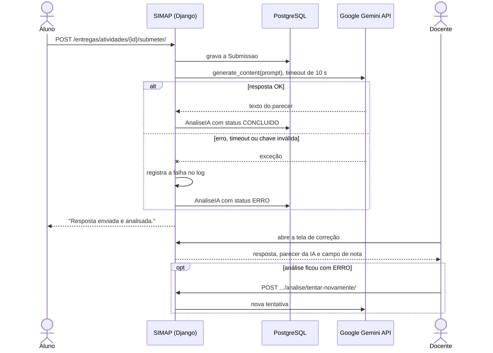
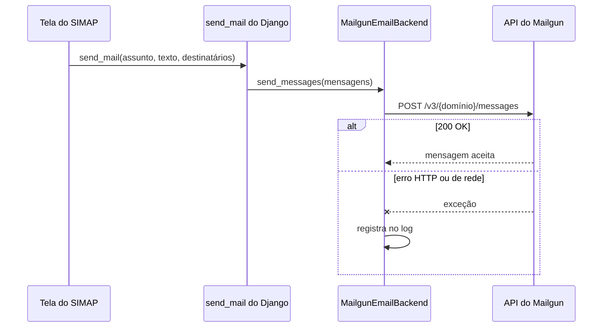

# Integração com APIs externas

O SIMAP consome duas APIs externas:

| API | Para que serve no SIMAP | Onde está o código |
|---|---|---|
| **Google Gemini** | Gera um parecer consultivo sobre a resposta que o aluno enviou numa atividade | `entregas/ia_services.py` |
| **Mailgun** | Envia os e-mails do sistema: recuperação de senha e aviso aos alunos com atividade pendente | `usuarios/email_backend.py` |

As duas seguem a mesma regra, que vem da ficha do projeto: **se a API externa falhar, o SIMAP continua funcionando.** A falha fica registrada no log e o usuário recebe um aviso, mas nenhuma tela quebra.

---

## 1. Google Gemini (análise assistida por IA)

### Finalidade

Quando o aluno envia a resposta de uma atividade, o Gemini lê o enunciado e a resposta e escreve um parecer curto. **O parecer é só uma sugestão para o docente.** A nota oficial é sempre dada pelo professor, na tela de correção.

### Fluxo



### Detalhes técnicos

| Item | Valor |
|---|---|
| Biblioteca | `google-generativeai` (SDK oficial em Python) |
| Modelo | `gemini-3.1-flash-lite` (constante `GEMINI_MODEL`) |
| Autenticação | Chave de API, lida de `GEMINI_API_KEY` no `.env` |
| Chamada | `GenerativeModel(GEMINI_MODEL).generate_content(prompt)` |
| Tempo limite | 10 segundos (constante `GEMINI_TIMEOUT_SEGUNDOS`) |
| Resultado | Guardado no modelo `AnaliseIA`, ligado à `Submissao` |

**O que é enviado ao Gemini:** apenas o enunciado da atividade e o texto da resposta. **Nome, RGM, e-mail e qualquer outro dado de identificação do aluno não são enviados.** Isso está de acordo com a cláusula 4.4 dos Termos de Uso.

**Prompt usado:**

```text
Você é um assistente que avalia respostas de alunos.

Enunciado da atividade:
{enunciado}

Resposta do aluno:
{resposta}

Escreva um parecer breve sobre a correção da resposta.
Responda em texto simples, sem Markdown.
```

### Estados da análise

| Status | Quando acontece | O que o docente vê |
|---|---|---|
| `PENDENTE` | A análise foi criada, mas a resposta ainda não chegou | Aguardando |
| `CONCLUIDO` | O Gemini respondeu | O parecer em texto |
| `ERRO` | Falha de rede, tempo esgotado, chave inválida ou cota estourada | Aviso de erro e o botão **Tentar novamente** |

### Tratamento de falhas

Qualquer exceção na chamada é capturada. A submissão do aluno **nunca se perde**, porque ela é gravada antes da chamada ao Gemini. A análise fica com status `ERRO`, e o erro completo vai para o log da aplicação com o ID da submissão. O docente pode pedir uma nova tentativa pela tela de correção.

### LGPD

O envio ao Gemini envolve **transferência internacional de dados**, porque os servidores do Google ficam fora do Brasil. Por isso ele depende de consentimento específico do aluno, colhido no Termo de Aceite (cláusulas 4.3.1, 4.5 e 12).

### Configuração

```env
GEMINI_API_KEY=sua_chave_do_google_ai_studio
```

A chave é gerada gratuitamente em <https://aistudio.google.com/>. Sem ela, todas as análises ficam com status `ERRO`, e o resto do sistema funciona normalmente.

---

## 2. Mailgun (e-mail transacional)

### Finalidade

O Mailgun envia os e-mails do SIMAP:

- **Recuperação de senha:** o link para criar uma senha nova
- **Aviso de pendência:** o docente avisa os alunos que ainda não entregaram uma atividade

### Como está integrado

Em vez de chamar o Mailgun direto nas telas, criamos um **backend de e-mail do Django** (`MailgunEmailBackend`). Assim, qualquer parte do sistema que use o `send_mail` padrão do Django passa a enviar pelo Mailgun, sem saber disso. Trocar de provedor no futuro exige mudar só esse arquivo.



### Detalhes técnicos

| Item | Valor |
|---|---|
| Endpoint | `POST {MAILGUN_API_URL}/v3/{MAILGUN_DOMAIN}/messages` |
| Autenticação | HTTP Basic, usuário `api` e senha `MAILGUN_API_KEY` |
| Formato do envio | `application/x-www-form-urlencoded` com `from`, `to`, `subject` e `text` (ou `html`) |
| Biblioteca | `requests` |
| Tempo limite | 15 segundos |
| Resposta esperada | HTTP 200; qualquer código 4xx ou 5xx vira erro |

**O que é enviado ao Mailgun:** o e-mail do destinatário, o assunto e o texto da mensagem. Nenhum outro dado.

### Tratamento de falhas

- **Chave ou domínio ausentes:** o backend recusa o envio com `ImproperlyConfigured`, com uma mensagem clara sobre o que falta configurar.
- **Erro de rede ou HTTP:** o backend registra o erro no log (`usuarios.email_backend`) e repassa a exceção para quem pediu o envio, que decide o que mostrar:
  - **Aviso de pendência:** a tela captura o erro, registra no log `simap.integracoes` e mostra ao docente *"Não foi possível enviar os e-mails agora. Tente novamente em alguns minutos."*
  - **Recuperação de senha:** o próprio Django captura o erro e registra no log. A tela seguinte é a mesma de sempre ("se o e-mail existir, enviamos o link"), o que também evita revelar quais e-mails estão cadastrados.

### Testes automatizados

As duas integrações têm testes que simulam a API externa, inclusive fora do ar (`entregas/tests.py` e `usuarios/tests.py`). Nenhum deles chama as APIs de verdade.

| Teste | O que prova |
|---|---|
| Parecer gravado quando a API responde | O fluxo feliz do Gemini |
| Só enunciado e resposta são enviados | Nome, login, RGM e e-mail do aluno não saem do sistema (LGPD) |
| Falha da API marca erro sem quebrar | Timeout do Gemini vira status `ERRO` e log |
| Submissão não se perde quando a API falha | A resposta do aluno é gravada mesmo com o Gemini fora do ar |
| Chamada HTTP ao Mailgun | Endpoint, autenticação, destinatário e tempo limite corretos |
| Mailgun fora do ar não derruba a tela | O docente recebe um aviso, e não um erro 500 |
| Recuperação de senha com Mailgun fora do ar | A tela segue normalmente |

### Configuração

Em **desenvolvimento**, os e-mails aparecem apenas no terminal e nada é enviado de verdade:

```env
EMAIL_BACKEND=django.core.mail.backends.console.EmailBackend
```

Em **produção**, o `.env` aponta para o Mailgun:

```env
EMAIL_BACKEND=usuarios.email_backend.MailgunEmailBackend
MAILGUN_API_KEY=sua_chave
MAILGUN_DOMAIN=seu-dominio.mailgun.org
MAILGUN_API_URL=https://api.mailgun.net
DEFAULT_FROM_EMAIL=SIMAP <nao-responda@seu-dominio.mailgun.org>
```

---

## 3. Segurança das integrações

- **As chaves nunca ficam no código.** Todas vêm do `.env`, que está no `.gitignore`.
- **Toda chamada externa tem tempo limite** (10 s no Gemini e 15 s no Mailgun), para uma API lenta não travar o sistema.
- **As falhas vão para o log** e não derrubam a requisição do usuário.
- **Só o mínimo necessário sai do sistema:** o Gemini recebe o enunciado e a resposta, e o Mailgun recebe o e-mail e o texto da mensagem.
- **As ações que envolvem as APIs ficam na auditoria:** envio de resposta, geração da análise e atribuição de nota são registrados como criação ou alteração nos modelos `Submissao`, `AnaliseIA` e `AvaliacaoOficial`.

## 4. Pontos de atenção para as próximas versões

- **O pacote `google-generativeai` foi descontinuado pelo Google**, que recomenda migrar para o `google-genai`. Ele ainda funciona, mas exibe um aviso ao iniciar o sistema.
- **A análise do Gemini acontece durante a requisição do aluno.** Se o Gemini demorar, o aluno espera até 10 segundos. Numa escala maior, o ideal é mover essa chamada para uma fila de tarefas em segundo plano.
